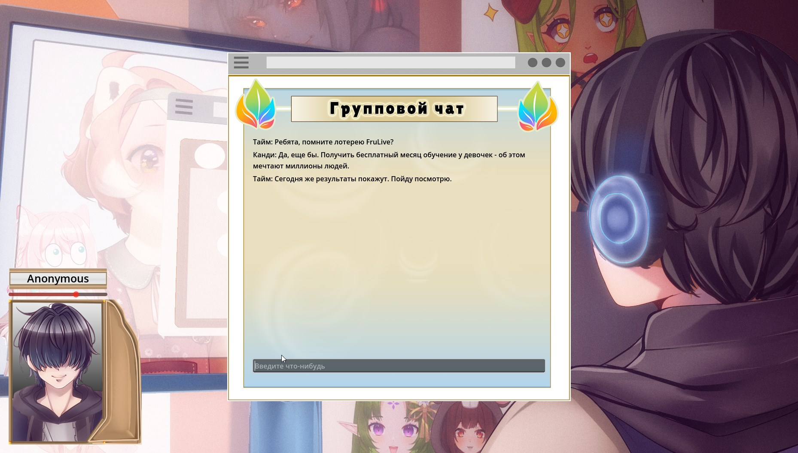
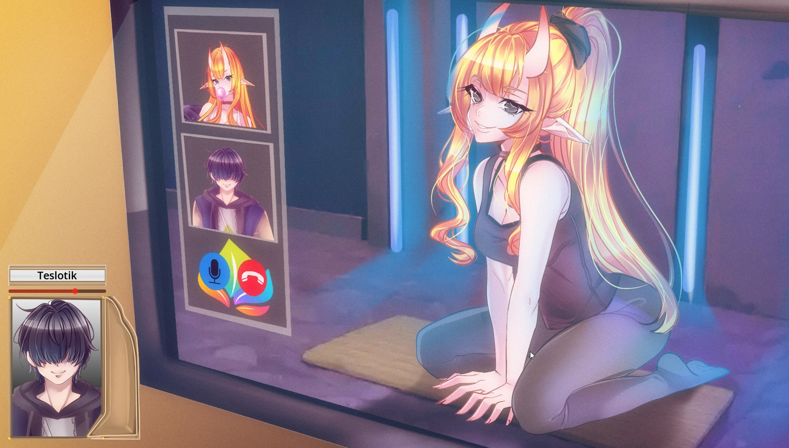
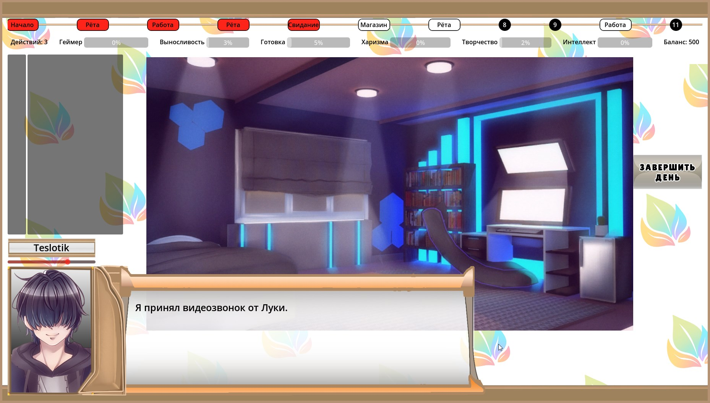
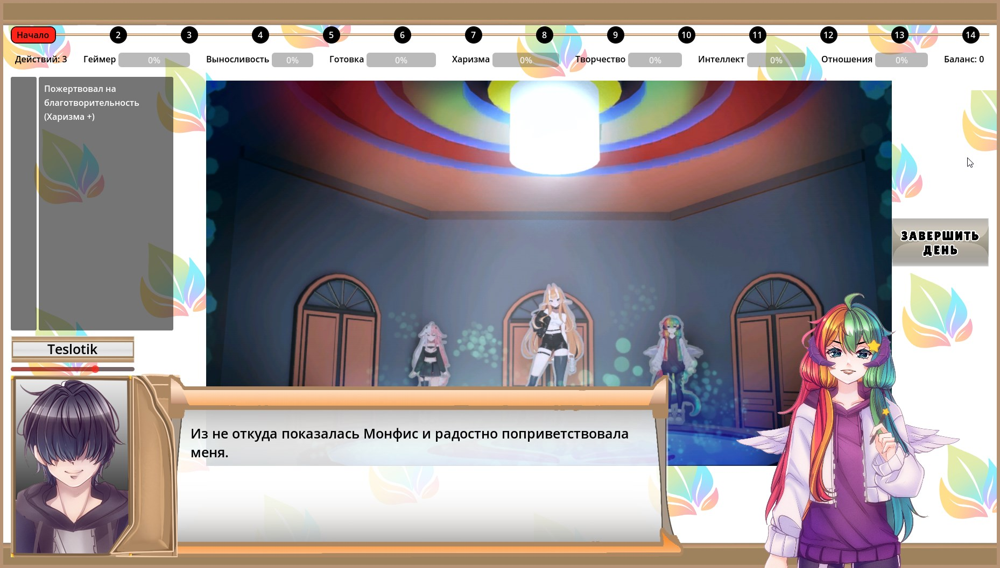
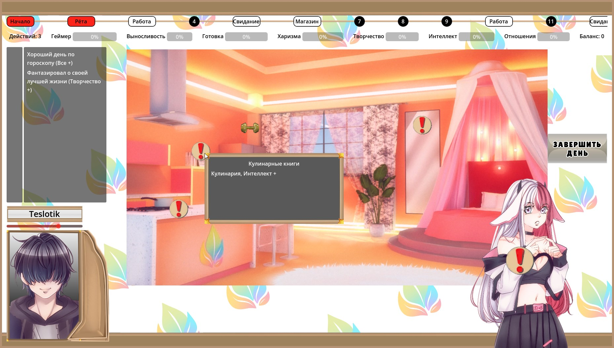

# VtuberStar

VtuberStar is a visual novel made in 45 days.

The goal of this project was to test a new modular architecture build on top of Godot game engine.

The architecture consists of entities, factories, state machines (FSTM and NFA) callbacks and a plugin system.

You can start exploring code from the `Rules.cs` file. The `Rules` class is a resource locator and also used for factories registration.

Also check the `Plugins` folder where narration is located.

## Screenshots

## Links

Contact with me: <teslotik@gmail.com>

[FruLive's Jam](https://vk.com/frulive_vtubers)

[My discord](https://discord.gg/duDwM6PjGk)

[VK Group](https://vk.com/timeproject_novella)

